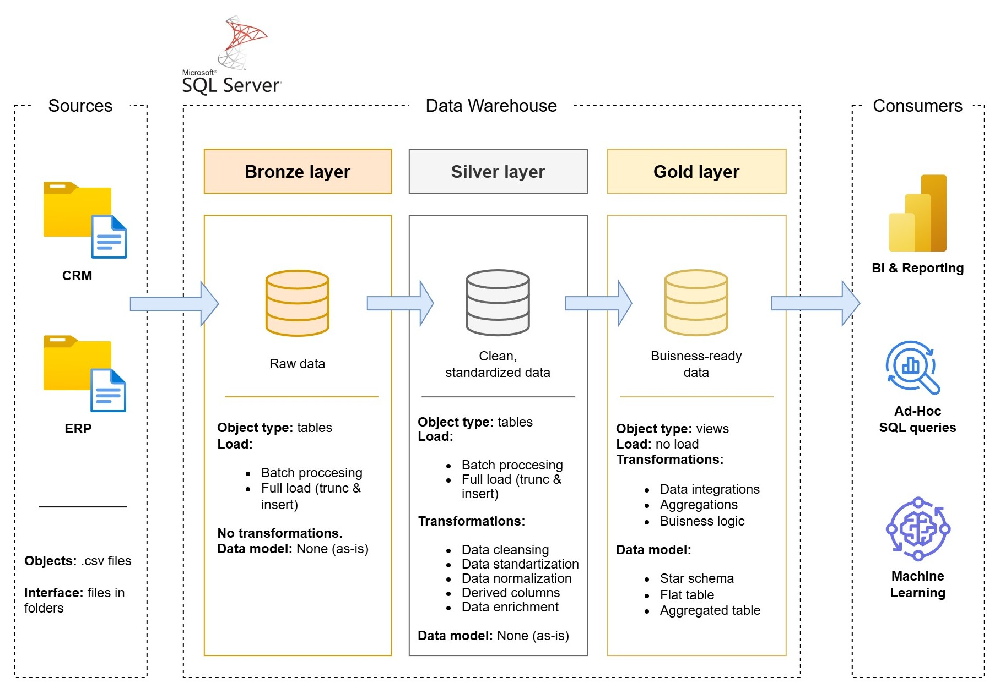
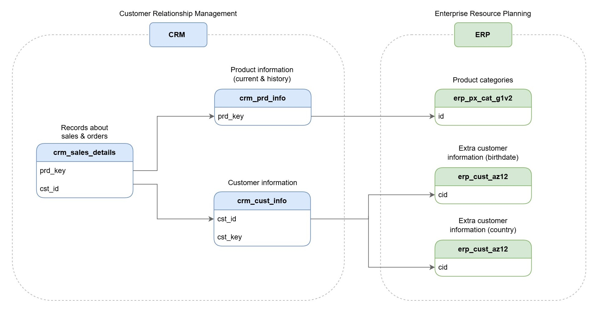
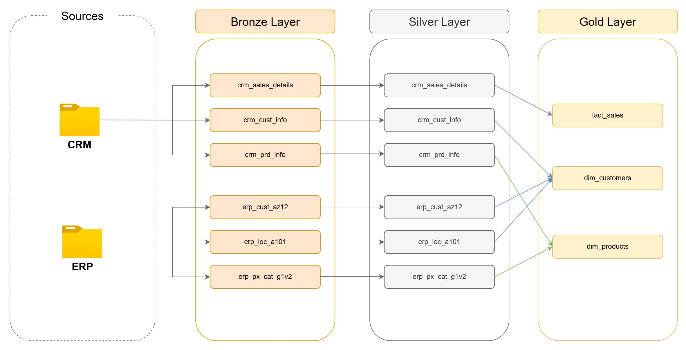
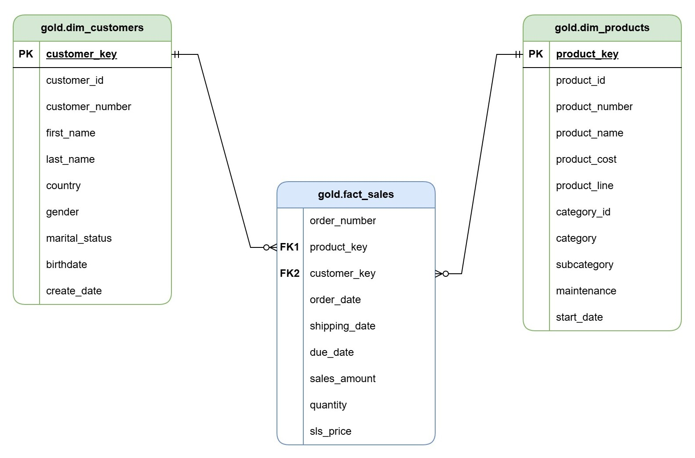

# dwh-project
Building a Medallion DWH with SQL Server, including ELT processing, data modeling, and analytics.

## Data Architecture
The data architecture for this project follows Medallion Architecture.

1. **Bronze Layer**: Stores raw data as-is from the source systems. Data is ingested from CSV Files into SQL Server Database.
2. **Silver Layer**: This layer includes data cleansing, standardization, and normalization processes to prepare data for analysis.
3. **Gold Layer**: Houses business-ready data modeled into a star schema required for reporting and analytics.

## Data Integration

## Data Flow

`Sources → Bronze (raw copy) → Silver (cleaned/joined) → Gold (aggregated/denormalized)`
**Source Layer:** 
Raw data is extracted from operational systems:
- **CRM System** – Provides sales transactions, customer master, and product master data.
- **ERP System** – Provides supplementary customer attributes (birthdate, country) and product category information.

**Bronze Layer:** 
Data is stored exactly as-is from the source systems.
- No cleaning, deduplication, or transformations are applied.
- Preserves original data types, formats, and structures.

**Silver Layer:** 
Data is cleaned, deduplicated, and standardized.
- Missing values are handled, formats are unified, and invalid records are filtered out.
- Key mappings are resolved (e.g., linking CRM `cst_id` to ERP `cid`).
- Data from CRM and ERP is joined and enriched to create consistent, integrated tables.
- Business rules are applied to ensure data quality and consistency.

**Gold Layer:** 
Data is aggregated and denormalized into star-schema **fact** and **dimension** tables.
- `fact_sales` – contains transactional metrics (e.g., sales amount) linked to customer and product keys.
- `dim_customers` – unified customer view (combining CRM customer info + ERP birthdate + country).
- `dim_products` – unified product view (combining CRM product info + ERP category).

## Data Mart Model (Star Schema)

